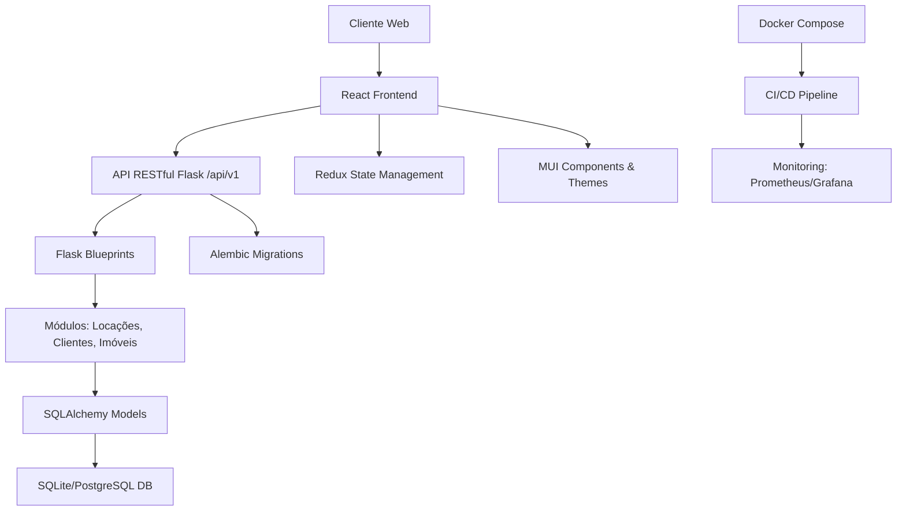

# Painel de Gerenciamento Imobiliário Avançado

## Visão Geral
Este projeto é um painel web altamente modular e escalável para gestão imobiliária completa. Desenvolvido com foco em ferramentas integradas para controle de contratos, locações, clientes e imóveis, priorizando modularidade, minimalismo e desempenho. O backend utiliza Flask com SQLAlchemy (inicialmente SQLite, migrável para PostgreSQL), enquanto o frontend é construído com React e Material-UI (MUI) para uma interface profissional e responsiva.

### Principais Características
- **Modularidade**: Estrutura baseada em Flask Blueprints e lazy loading no React para fácil adição de módulos.
- **UI/UX Profissional**: Temas MUI customizados com dark/light modes, animações suaves e design responsivo.
- **Performance**: Caching, queries otimizadas e lazy loading para eficiência.
- **Segurança e Qualidade**: Autenticação planejada (JWT/OAuth2), testes abrangentes e compliance com melhores práticas.
- **Integrações**: Calendários, mapas, relatórios PDF/Excel, notificações via email/SMS.

## Instalação e Configuração

### Pré-requisitos
- Python 3.8+
- Node.js 16+
- Git
- VSCode (recomendado para debugging)

### Passos de Instalação

1. **Clone o repositório**:
   ```bash
   git clone <url-do-repositorio>
   cd locaweb2
   ```

2. **Backend Setup**:
   - Crie e ative o ambiente virtual:
     ```bash
     python -m venv env
     env\Scripts\activate  # Windows
     # source env/bin/activate  # Linux/Mac
     ```
   - Instale dependências:
     ```bash
     pip install -r requirements.txt
     ```

3. **Frontend Setup**:
   - Navegue para o diretório frontend (a ser criado):
     ```bash
     cd frontend
     npm install
     ```

4. **Configuração de Ambiente**:
   - Copie `.env.example` para `.env` e configure as variáveis necessárias (e.g., SECRET_KEY, DATABASE_URL).

5. **Inicialização do Banco de Dados**:
   ```bash
   flask db init
   flask db migrate
   flask db upgrade
   ```

## Comandos de Execução

### Desenvolvimento
- **Backend**:
  ```bash
  # Ative o venv
  env\Scripts\activate
  # Execute o servidor Flask
  flask run
  ```
- **Frontend**:
  ```bash
  cd frontend
  npm start
  ```

### Produção
- **Backend**: Use Gunicorn para servir a aplicação.
  ```bash
  gunicorn -w 4 -b 0.0.0.0:8000 main:app
  ```
- **Frontend**: Build para produção.
  ```bash
  npm run build
  ```

### Testes
- **Backend**: `pytest`
- **Frontend**: `npm test`
- **E2E**: `npx cypress run`

### Debugging
- Use o launch.json no VSCode para debugging Python.
- Para React, utilize as ferramentas de desenvolvedor do navegador.

## Arquitetura do Sistema



### Estrutura de Diretórios
```
locaweb2/
├── backend/
│   ├── app/
│   │   ├── __init__.py
│   │   ├── models/
│   │   ├── routes/
│   │   └── blueprints/
│   ├── migrations/
│   ├── tests/
│   └── main.py
├── frontend/
│   ├── src/
│   │   ├── components/
│   │   ├── pages/
│   │   ├── hooks/
│   │   └── store/
│   ├── public/
│   └── package.json
├── .env
├── requirements.txt
├── README.md
├── roadmap.md
└── docker-compose.yml
```

## Roadmap e Desenvolvimento
Consulte `roadmap.md` para detalhes sobre as fases de desenvolvimento, prazos estimados e milestones.

## Contribuição
- Siga as melhores práticas: PEP8 para Python, ESLint para JS/TS.
- Commits frequentes a cada milestone.
- Pull requests com testes e documentação.

## Licença
Este projeto é licenciado sob [MIT License](LICENSE).

## Suporte
Para dúvidas ou issues, abra uma issue no repositório ou entre em contato com a equipe de desenvolvimento.