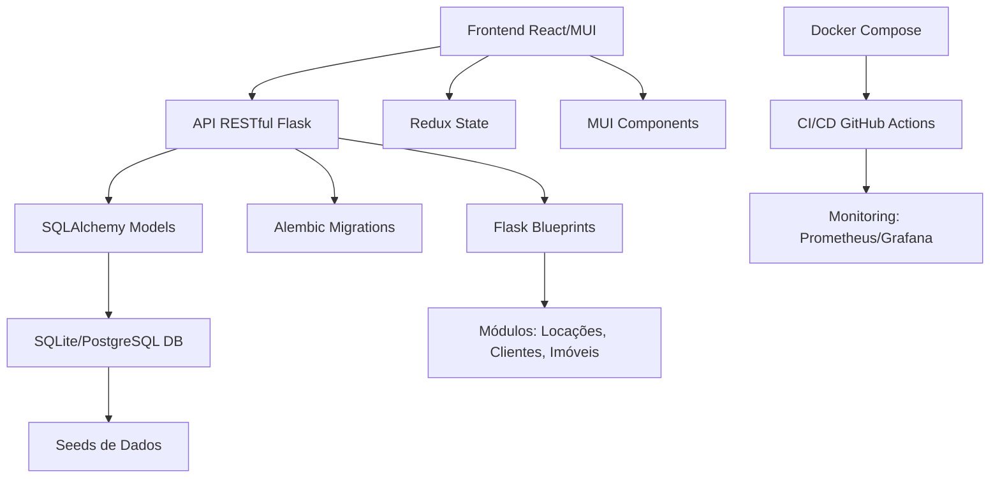

# Roadmap do Projeto: Painel de Gerenciamento Imobiliário Avançado

## Visão Geral
Este roadmap detalha as fases de desenvolvimento do painel web modular para gestão imobiliária. O projeto prioriza modularidade, minimalismo e escalabilidade, com backend em Flask/Python e frontend em React/MUI. Cada fase inclui descrições, prazos estimados, dependências, riscos e métricas de sucesso.

## Fases do Desenvolvimento

### Fase 0: Planejamento (1 semana)
- **Descrição**: Análise detalhada dos requisitos, criação de wireframes no Figma, diagrama ERD do banco de dados via Draw.io, e definição da arquitetura geral.
- **Atividades**:
  - Reunião de requisitos com stakeholders.
  - Design de wireframes para dashboard, módulos e fluxos de usuário.
  - Modelagem do banco de dados (tabelas para usuários, locações, clientes, imóveis).
  - Definição de APIs e integrações iniciais.
- **Dependências**: Acesso a ferramentas como Figma e Draw.io.
- **Riscos**: Mudanças nos requisitos podem atrasar o início.
- **Métricas de Sucesso**: Wireframes aprovados, ERD completo, documento de arquitetura assinado.

### Fase 1: Setup Inicial (1 semana)
- **Descrição**: Configuração do ambiente de desenvolvimento, gerenciamento de dependências e inicialização do repositório Git.
- **Atividades**:
  - Criar venv Python e instalar dependências (Flask, SQLAlchemy, etc.).
  - Configurar React com TypeScript e MUI.
  - Gerar requirements.txt e package.json.
  - Criar .gitignore, .env e launch.json para VSCode.
  - Inicializar repositório Git e primeiro commit.
- **Dependências**: Python 3.x, Node.js, VSCode.
- **Riscos**: Conflitos de versões de dependências.
- **Métricas de Sucesso**: Ambiente funcional, dependências instaladas, repositório Git ativo.

### Fase 2: Backend Fundação (2 semanas)
- **Descrição**: Implementação da base do backend com Flask, modelos SQLAlchemy e migrações.
- **Atividades**:
  - Configurar app Flask com blueprints.
  - Definir modelos SQLAlchemy para usuários, roles, locações, etc.
  - Implementar migrações com Alembic.
  - Criar routes base da API (/api/v1).
  - Adicionar logging e error handling básico.
- **Dependências**: Fase 1 completa.
- **Riscos**: Problemas de compatibilidade com SQLAlchemy 2.x.
- **Métricas de Sucesso**: API básica funcional, modelos criados, testes unitários passando.

### Fase 3: Frontend Esqueleto (2 semanas)
- **Descrição**: Configuração do frontend React com MUI, temas customizados e layout principal.
- **Atividades**:
  - Setup React com CRA e TypeScript.
  - Implementar tema MUI (dark/light modes, paleta imobiliária).
  - Criar layout com AppBar, Drawer e Grid responsivo.
  - Configurar React Router para navegação.
  - Integrar Redux/Toolkit para state management.
- **Dependências**: Fase 1 completa.
- **Riscos**: Curva de aprendizado com MUI 5.x.
- **Métricas de Sucesso**: Layout responsivo, navegação funcional, tema aplicado.

### Fase 4: Módulo Locações Core (3 semanas)
- **Descrição**: Desenvolvimento do módulo principal de locações com CRUD, agendas e relatórios.
- **Atividades**:
  - Implementar routes API para locações (anuais/sazonais).
  - Criar componentes React para CRUD de contratos e clientes.
  - Integrar calendário MUI com drag-drop e iCal export.
  - Adicionar cálculos automáticos (vencimentos, multas).
  - Gerar relatórios com gráficos MUI Charts.
- **Dependências**: Fases 2 e 3 completas.
- **Riscos**: Complexidade de cálculos financeiros.
- **Métricas de Sucesso**: Módulo funcional, testes de integração passando.

### Fase 5: Módulos Clientes/Imóveis (3 semanas)
- **Descrição**: Expansão iterativa para módulos de clientes e imóveis, reutilizando componentes.
- **Atividades**:
  - CRUD para clientes com funil de vendas (Kanban MUI).
  - Cadastro de imóveis com upload de mídia e mapas.
  - Integrações com APIs externas (Google Maps, Serasa se aplicável).
  - Reutilização de componentes de formulários e tabelas.
- **Dependências**: Fase 4 completa.
- **Riscos**: Dependências externas podem falhar.
- **Métricas de Sucesso**: Módulos integrados, cobertura de testes >80%.

### Fase 6: Qualidade/Tests (2 semanas)
- **Descrição**: Implementação de suíte de testes, linting e ferramentas de debug.
- **Atividades**:
  - Configurar PyTest para backend, Jest para frontend.
  - Adicionar Cypress para E2E.
  - Implementar linting (Black, ESLint) e coverage >90%.
  - Debugging com pdb e React Profiler.
- **Dependências**: Fases anteriores completas.
- **Riscos**: Testes lentos impactam produtividade.
- **Métricas de Sucesso**: Cobertura de testes alta, pipeline CI passando.

### Fase 7: Infra/Deploy (2 semanas)
- **Descrição**: Configuração de CI/CD, containerização e monitoramento.
- **Atividades**:
  - GitHub Actions para lint, test, build.
  - Docker e docker-compose para dev/prod.
  - Monitoring com Prometheus, Grafana e Sentry.
  - Health checks e secrets management.
- **Dependências**: Fase 6 completa.
- **Riscos**: Configuração de Docker complexa.
- **Métricas de Sucesso**: Deploy automático, monitoramento ativo.

### Fase 8: Otimizações/Refator (2 semanas)
- **Descrição**: Tuning de performance, error handling avançado e internacionalização.
- **Atividades**:
  - Caching com Flask-Caching, lazy loading no frontend.
  - Error handling global e logging estruturado.
  - i18n com react-i18next.
  - Profiling e otimização de queries.
- **Dependências**: Fase 7 completa.
- **Riscos**: Otimizações podem introduzir bugs.
- **Métricas de Sucesso**: Performance melhorada, app multilíngue.

### Fase 9: Expansão/Futuro (Variável)
- **Descrição**: Adição de autenticação, real-time e módulos futuros.
- **Atividades**:
  - JWT/OAuth2 com Flask-JWT-Extended.
  - WebSockets para notificações.
  - Módulos financeiros, manutenção e integrações.
- **Dependências**: Fases anteriores.
- **Riscos**: Escopo creep.
- **Métricas de Sucesso**: Sistema completo e escalável.

## Arquitetura Geral

## Cronograma Estimado
- **Total**: ~18 semanas (4-5 meses).
- **Milestones**: Commit Git a cada fase, revisão de código.

## Dependências Externas
- APIs: Google Maps, Serasa (se aplicável), Twilio para SMS.
- Ferramentas: Figma, Draw.io, VSCode, GitHub.

## Riscos Gerais
- Mudanças tecnológicas (e.g., depreciações em MUI).
- Compliance com leis de dados (GDPR-like).

Este roadmap será atualizado conforme progresso e feedback.